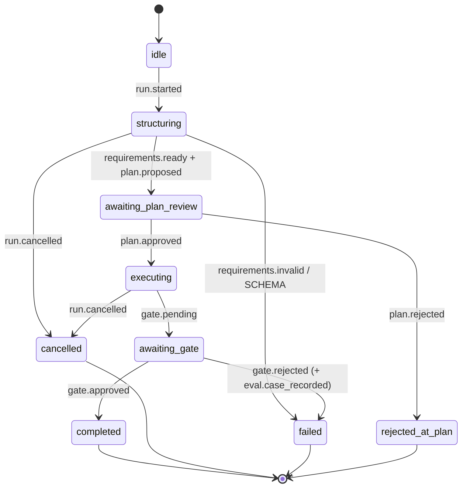

# Event & state machine

정본(전략 위키): 모노레포 `portfolio/docs/wiki/concepts/concept-workbench-protocol.md`

## Run 상태

`idle → structuring → awaiting_plan_review → executing → awaiting_gate → completed|failed|cancelled`

터미널: `completed`, `cancelled`, `rejected_at_plan`, `failed`

## HITL

| 액션 | 이벤트 / API |
| --- | --- |
| 계획 승인 | `plan.approved` → execute |
| 계획 거절 | `plan.rejected` |
| 도구 인자 수정 | `tool.args_edited` — client-mock `waitArgsEdit` 또는 HTTP `POST …/continue` `action=args_edit` |
| 인자 확인 후 계속 | HTTP `action=args_continue` (Worker `play`가 첫 `tool.started` 후 게이트 해제) |
| 게이트 승인 | `gate.approved` + `run.completed` |
| 게이트 거절 | `gate.rejected` |
| 취소 | `run.cancelled` |
| SSE 중단 복구 | `GET /runs/:id` 스냅샷 → 클라이언트 `stream.reconnect` (`recoveredFrom: run-snapshot`) |

HTTP execute 경로: Worker `play()`는 첫 `tool.started` 이후 soft-timeout(기본 12s) 또는 `args_continue`/`args_edit`까지 스트림을 일시정지한다.

## 배포 모드 (라이브)

| 모드 | 설명 |
| --- | --- |
| **HTTP SSE mock** | `POST /workbench/api/runs/stream` — Cloudflare Worker deterministic fixtures |
| **Workers AI** | 같은 엔드포인트 `mode=workers-ai` — `@cf/meta/llama-3.2-3b-instruct` 구조화 + 스키마 실패 시 휴리스틱 폴백 |
| **Client mock** | SSE 불가 시 브라우저 fixture 폴백 |

프론트 `applyEvent`는 세 모드 동일 이벤트 프로토콜을 소비한다.

## 관측

- `metrics.sample`: `ttftMs`, `totalMs`, `tokens`, `costUsd` (`null` when unmetered), `provider`, `model`, `promptVersion`
- `trace.span`: 구간명·시작/끝·attrs — execute 종료 시 `name: "run_persisted"`에 `toolNames`/`eventCount`/`mode` (SSE로 KV race 없이 증거 가능)
- 중복 실행: KV `WORKBENCH_IDEMPOTENCY` + 인메모리 → `run.duplicate_blocked`
- curl 평가 요약: `GET /workbench/api/evals` (`fixtureCoverage` 포함)

## 주요 API

| Method | Path | 비고 |
| --- | --- | --- |
| GET | `/workbench/api/health` | `sse`/`kv`/`ai`/`evals` |
| GET | `/workbench/api/evals` | mock + Workers AI spot gate summary |
| GET | `/workbench/api/protocol` | 이벤트·프롬프트 버전 JSON |
| GET | `/workbench/api/runs/:id` | **KV 우선** 스냅샷 (`eventTypes`/`toolNames`) — isolate 간 hybrid continue 후 정본 |
| POST | `/workbench/api/runs/stream` | SSE 구조화; 완료 후 KV `run:{id}` persist |
| POST | `/workbench/api/runs/:id/continue` | `approve`/`reject`/`gate_*`/`args_continue`/`args_edit` — isolate 간 KV resume |
| POST | `/workbench/api/runs/:id/cancel` | 취소 |

Worker 인스턴스가 달라도 `WORKBENCH_IDEMPOTENCY` KV로 run 메타·args 게이트 신호를 공유한다. GET 스냅샷은 메모리보다 KV를 우선한다(구조화 isolate의 구 상태 방지).
